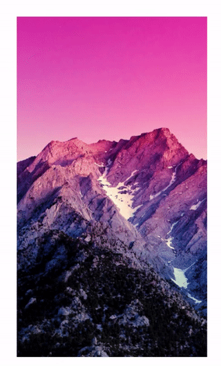

# React Glitch Image

### Allows display images with a glitch effect

```javascript
    <GlitchImage image="image.jpg"/>
```
## Very simple!



## Parameters to get complicated (props)!

| name               | default  | description                                                         |
|--------------------|----------|---------------------------------------------------------------------|
| width              | 20       | Width (used in the styled in rem)                                   |
| splitSize          | 8        | Number of divisions                                                 |
| animationInterval  | 4000     | Time interval to repeat animation (measured in ms)                  |
| animationDuration  | 400      | I really have to describe this (measured in ms)                     |
| variations         | [1.8, 3] | Intensity of the effect of each layer                               |
| inside             | false    | Defines if the effect is seen outside the container                 |
| activeFxOnInterval | true     | Activate the glitch effect in the animationInterval                 |
| activeFxOnHover    | true     | activate the glitch effect on hover                                 |
| opacity            | 0.3      | layer 2 opacity                                                     |
| filter             | true     | Activate aleatory hue-rotate filter value and brightness in layer 2 |
| brightness         | 2        | Brightness filter intensity                                         |
| customFilter       | null     | Deactivate the previous filter for a more personalized filter       |


## customFilter
This property receives normal filters for css property, 
however, you can specify a random value for each filter.
using `$<number>` you can indicate the maximum value that will be generated randomly.

### Example 1:
- `customFilter="invert($20%)"` 
- Generates a random value from 0 to 20

### Example 2:

- `customFilter=invert($100%) saturate(100%) hue-rotate($200deg) brightness(2)`
- This generates random values from 0 to 100 for invert, and from 0 to 200 for hue-rotate

### Note:
Every time the filter is activated using activeFxOnInterval,
this again generates random values for the customFilter,
each layer generate a different random